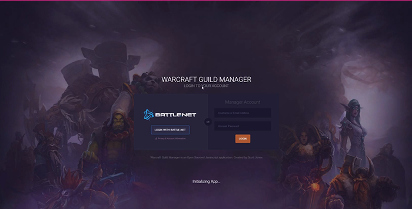
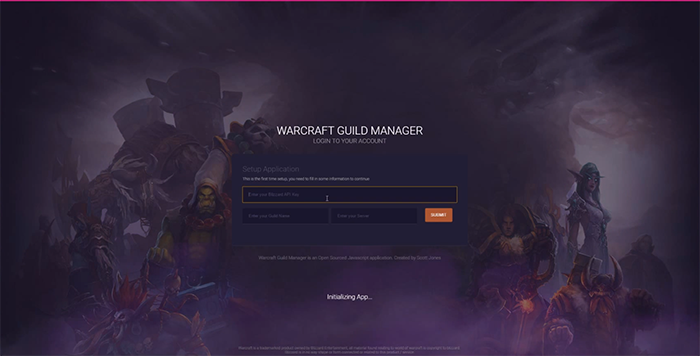
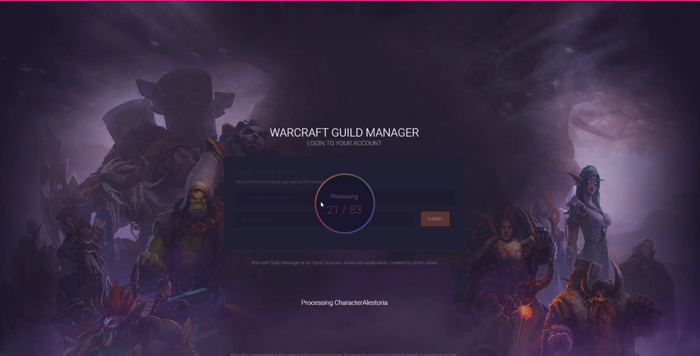

Warcraft Desktop Guild Manager Application
===================

----------

About The project
-------------

This is a project using ElectronJs, NodeJs, NPM, ES6 and AvaJS to build a desktop application for World of Warcraft. It's currently in a pre-alpha stage with only the foundation of the application being setup.

* Event driven communication between components / Utils
* Basic State management
* Initial login component
* The application Setup Component
* Initial design and animations

The goal is to build a fully working application that will enable guild masters to mange their guilds. While also open sourcing the code so developers can take advantage of the code in the various stages for their own projects.

Guild Masters and Officers will have the ability to manage events, dkp, raid rosters and potentially more in the initial release. 

Updates will be sparatic as work on this is done in my limited spare time.

Video on how the design was made:
https://www.youtube.com/watch?v=d3cwVzmeWNI

Video of the application working:
https://www.youtube.com/watch?v=_9JbZNU7BSc (0.1)

----------

Desired Features
-------------
* Export guild information in an easy format, between guild members
* DKP management
* Event management
* Roster management
* Notifications
* API to allow ingame addons to access the information
* Exporting / sharing the information between members in real-time.

----------

Known Issues
-------------
* No mobile / small screen support

----------

Desired Technical Changes
-------------
* Cleanup component structure
* Add clear documentation to utilities
* Personalize the application more
* ES7/8 Features
